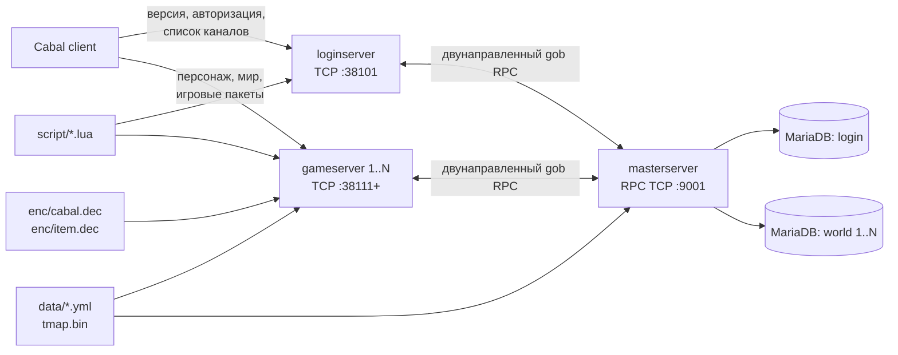

# Карта проекта Freya

Снимок составлен по текущему коду 30 июля 2026 года. Это навигационный документ,
а не обещание полной реализации всех возможностей Cabal.

Оперативный список незавершённых задач и критерии готовности находятся в
[`docs/NEXT_STEPS.md`](NEXT_STEPS.md).

## Архитектура



### Роли процессов

| Процесс | Ответственность | Точка входа |
|---|---|---|
| `masterserver` | Реестр Login/Game серверов, авторизация, доступ к Login/World DB, сохранение персонажей, вещей, навыков и quick links | `cmd/masterserver/main.go` |
| `loginserver` | Клиентский handshake, проверка версии, логин, список серверов/каналов, URL сервисов | `cmd/loginserver/main.go` |
| `gameserver` | Лобби персонажей, вход в мир, движение, бой, мобы, предметы, инвентарь, навыки, Lua-команды | `cmd/gameserver/main.go` |

`loginserver` и `gameserver` являются RPC-клиентами Master, но transport
двунаправленный: Master также вызывает зарегистрированные на них
`UserVerify` и `OnlineCheck`.

## Инициализация

### Master

1. Читает `cfg/masterserver.ini`.
2. Регистрирует события и RPC handlers.
3. Подключается к Login DB.
4. Подключает все секции `[game_1]` … `[game_255]` как отдельные World DB.
5. Загружает `data/initial_data.yml`.
6. Слушает RPC на порту 9001.

### Login

1. Читает `cfg/loginserver.ini`.
2. Создаёт XOR-таблицу и RSA-ключ.
3. Регистрирует события, клиентские пакеты, Lua и обратные RPC handlers.
4. В фоне подключается/переподключается к Master раз в 3 секунды.
5. Слушает клиентский TCP на порту 38101.

### Game

1. Берёт `serverID` и `channelID` из аргументов, по умолчанию `1 1`.
2. Читает `cfg/gameserver_<serverID>_<channelID>.ini`.
3. Загружает миры, варпы, шаблоны и размещение мобов.
4. Загружает и взаимно проверяет каталог книг навыков из клиентских
   `enc/cabal.dec` и `enc/item.dec`.
   Из `enc/cabal.dec` также загружаются пороги `exp_for_point`, условия
   `rankup_condition`, бонусы `rank_bonus` для мечевого/магического ранга и
   выдаваемые по класс-рангу навыки из `mastery_levelup`.
5. Регистрирует события, Lua, клиентские пакеты и обратные RPC handlers.
6. При подключении к Master загружает дроплист мобов из World DB через
   `LoadMobDropList` и держит его в `WorldManager`.
7. Подключается к Master и регистрирует канал.
8. Слушает клиентский TCP на настроенном порту.

Важно: поиск `cfg/`, `data/`, `enc/` и `script/` зависит от
`share/directory.Root()`, который удаляет первое вхождение `bin` из каталога
исполняемого файла. Стандартная раскладка с бинарниками в корневом `bin/`
является частью runtime-контракта.

## Основные потоки

### Авторизация и выбор канала

1. `share/network.Network` принимает TCP и создаёт `network.Session` с
   `UserIdx`, `AuthKey` и XOR state.
2. Login обрабатывает `CheckVersion` и `AuthAccount`.
3. `AuthAccount` вызывает Master RPC `AuthCheck`.
4. Master проверяет bcrypt hash в `accounts`, ищет двойной вход на всех
   зарегистрированных серверах и считает персонажей по World DB.
5. Login периодически запрашивает у Master `ServerList` и отправляет
   `ServerState` клиенту.
6. `VerifyLinks` проходит через Master обратно на нужный Login/Game server,
   где `Network.VerifyUser` связывает клиентскую сессию с ID аккаунта.

### Вход персонажа в мир

1. Game получает список персонажей через `LoadCharacters`.
2. `Initialized` проверяет, что `charId >> 3` совпадает с ID аккаунта.
3. Дополнительные данные загружаются через `LoadCharacterData`:
   inventory, skills, quick links; equipment входит в основной character load.
4. `Inventory`, `Equipment` и `Links` получают RPC connection через
   `Setup(...)`; `Warehouse` загружается вместе с `LoadCharacterData`.
5. `share/models/character/hp.go` и `mp.go` пересчитывают HP/MP по battle
	style, уровню и skill rank; HP также учитывает style mastery. При входе и
	level-up результат сохраняется через Master RPC `SaveVitals`/`SaveExperience`.
6. Опыт навыков хранится в `characters.sword_exp`/`magic_exp`, очки и прогресс
   ранга — в `sword_point`/`magic_point` и `sword_rank_exp`/`magic_rank_exp`.
   `SkillToMobs` начисляет опыт, выдаёт очки и автоматически повышает ранг
   через атомарный Master RPC `SaveSkillExperience`.
7. При входе и достижении нового уровня Game сверяет `mastery_levelup` с
   класс-рангом персонажа и через Master RPC `GrantBattleModeSkills` добавляет
   недостающие навыки боевых режимов в `characters_skills`.
8. `StorageExchangeMove` переносит предметы между инвентарём и складом через
   Master RPC `StorageMove` в одной SQL-транзакции.
9. `context.Context` получает выбранного персонажа, мир и клетку.
10. `World.EnterWorld` рассылает состояние соседним клеткам и запускает
   игровые события/Lua hooks.
11. При переходе в новую клетку, варпе, выходе из мира или отключении Game
   сохраняет последние `world/x/y` через Master RPC `SavePosition`.

### Дроп мобов

1. Master читает включённые правила из `mob_drop_list` и отдаёт их Game через
   RPC `LoadMobDropList`.
2. Game группирует правила по `mob_species` и при смерти моба выполняет
   независимый roll для каждой строки.
3. Выпавшие предметы создаются через `World.DropMobItem` и попадают в
   стандартный runtime-поток предмета на земле.

### Игровой пакет

```text
TCP read
  -> decrypt
  -> network.Reader
  -> PacketReceive event
  -> PacketHandler.Handle
  -> cmd/gameserver/packet handler
  -> Context / World / models
  -> optional Master RPC
  -> MariaDB
  -> network.Writer
  -> encrypt
  -> TCP write
```

### Покупка и использование книги навыка

1. Game сопоставляет NPC, набор и индекс навыка с каталогом из
   `cabal.dec`, затем проверяет предмет, цену и связанный навык по `item.dec`.
2. Покупка вызывает Master RPC `PurchaseItem`; Master в одной SQL-транзакции
   блокирует персонажа, списывает Alz и добавляет книгу в свободный слот.
3. При использовании Game определяет навык только по фактическому предмету в
   инвентаре и DEC-каталогу, после чего вызывает Master RPC `LearnSkill`.
4. `LearnSkill` в одной SQL-транзакции проверяет предмет и конфликты слотов,
   удаляет книгу и добавляет навык. Runtime-модели изменяются только после
   успешного ответа Master.

DEC-файлы являются runtime-входом и намеренно исключены из Git. После их
замены каталог перечитывается при следующем запуске GameServer; несовместимые
или повреждённые данные останавливают запуск с ошибкой вместо частичной загрузки.

## Владение состоянием

| Состояние | Runtime-владелец | Постоянное хранилище |
|---|---|---|
| Учётная запись, пароль, sub-password | Master | Login DB |
| Список серверов и каналов | Master `ServerManager` | Нет |
| TCP-сессия и online-флаги | Login/Game `Network` | Нет |
| Персонаж и его текущий context | Game | World DB через Master |
| Инвентарь, склад, экипировка, навыки, quick links | Game-модели + Master RPC | World DB |
| Каталог книг навыков и цены | Game `clientdata` | `enc/cabal.dec`, `enc/item.dec` |
| Миры, клетки, мобы, предметы на земле | Game `WorldManager` | YAML/runtime и `mob_drop_list` через Master |
| Конфигурация поведения | Каждый процесс | INI/YAML/Lua |

## Структура репозитория

```text
cmd/
  masterserver/   центральный RPC и MariaDB
  loginserver/    клиентский логин-протокол
  gameserver/     игровой протокол и мир
    clientdata/   проверенная загрузка клиентских DEC-каталогов
share/
  network/        TCP, Session, Reader/Writer, PacketHandler
  rpc/            двунаправленный RPC transport и имена методов
  models/         общие DTO и доменные модели
  encryption/     XOR протокол клиента
  event/          глобальная асинхронная event-шина
  script/         gopher-lua, события и команды
  conf/           простой INI reader
data/             YAML, карты проходимости и размещение мобов
enc/              локальные клиентские DEC-файлы (не отслеживаются Git)
script/           Lua scripts Login/Game
sql/              начальные схемы Login/World DB
cfg/              локальные INI
bin/              результаты сборки
```

Самые крупные и чувствительные зоны сейчас:

- `cmd/gameserver/packet/` — более 3 000 строк точного бинарного протокола;
- `cmd/gameserver/game/` — мир, клетки, мобы, pathfinding;
- `cmd/masterserver/rpc/` — SQL и граница постоянного состояния;
- `share/network/` и `share/rpc/` — общая конкурентная инфраструктура.

## Как расширять проект

### Новый клиентский пакет

1. Добавить opcode в соответствующий `packet/const.go`.
2. Добавить handler и зарегистрировать его в `packet/packet.go`.
3. Читать и писать поля строго в порядке и размере целевого client protocol.
4. Для общего состояния добавить DTO/RPC/SQL-путь.
5. Добавить golden test на бинарный ответ и тест на короткий/повреждённый вход.

### Новая сохраняемая механика

1. Определить владельца runtime state.
2. Добавить модель в `share/models/<domain>`.
3. Добавить RPC-константу и DTO.
4. Реализовать и зарегистрировать Master handler.
5. Выполнить SQL-операцию в транзакции, если меняется больше одной строки или
   таблицы.
6. Настроить модель после загрузки персонажа и проверить повторный вход.

### Новое Lua API

1. Реализовать `LuaCallable` рядом с конкретным сервером.
2. Зарегистрировать имя после `script.Initialize`.
3. Проверить тип `session_ud` и ошибки `context.Parse`.
4. Не держать Lua/global mutex во время блокирующего RPC или долгой работы.

## Сборка и локальный запуск

Минимальная compile-проверка:

```powershell
$env:GOCACHE = Join-Path $env:TEMP 'freya-go-build'
go test ./...
```

Прямая Windows-сборка:

```powershell
go build -buildvcs=false -o bin/masterserver.exe ./cmd/masterserver
go build -buildvcs=false -o bin/loginserver.exe ./cmd/loginserver
go build -buildvcs=false -o bin/gameserver.exe ./cmd/gameserver
```

Makefile предназначен прежде всего для Unix-подобного shell: он использует
`pwd`, `mkdir -p`, `rm -r` и inline `GOOS=...`.

Порядок запуска: MariaDB → Master → Login → один или несколько Game. Без
Master Login/Game продолжают пытаться переподключиться, но RPC-зависимые
операции работать не будут.

## Текущий baseline

На момент снимка:

- ветка `development`, tracking `origin/development`;
- рабочее дерево чистое после коммита `859036f`; runtime-файлы `enc/` остаются
  локальными и игнорируются Git;
- `go test ./...` успешно компилирует все пакеты; для DEC-каталога добавлены
  синтетический и интеграционный тесты;
- `UpgradeSkill`, покупка книги и изучение навыка проверены на клиенте;
- persistence-модели `Inventory`, `Equipment` и `Links` используют `ServerId`
  как индекс World DB; `Warehouse` загружается из World DB вместе с данными
  персонажа;
- текущая `AuthAccount` читает логин/пароль напрямую, а RSA decrypt закомментирован;
- локальный запуск Master/Login/Game успешен: процессы слушают 9001, 38101 и
  38111 и оба дочерних сервера регистрируются в Master;
- спавн мобов управляется параметром `[server] spawn_mobs`; в текущем
  `cfg/gameserver_1_1.ini` он включён, а проверка прежнего вылета клиента
  вынесена в `FREYA-001`;
- для миров 4-12, 22 и 30 отсутствуют `data/worldN/mobs.yml` и `tmap.bin`;
  Game продолжает работу, но эти миры загружаются без мобов/карты проходимости;
- Go toolchain окружения — 1.23.1, тогда как модуль и CI нацелены на Go 1.20;
- обычный Git требует локального `safe.directory` override из-за ownership.

Этот baseline нужен для отличия существующих проблем от регрессий новой задачи.
Оперативные изменения статусов ведутся в `docs/NEXT_STEPS.md`.

## Рабочий план

Ниже оставлены долгосрочные архитектурные направления. Приоритеты и
конкретные критерии текущей разработки находятся в `docs/NEXT_STEPS.md`.

### P0 — вернуть проверяемую основу

1. Проверить вертикальный срез `UpgradeSkill` в runtime: валидацию запроса,
   стоимость, очки, изменение модели и точный бинарный ответ.
2. Проверить `SaveSkill` на insert/update и сохранение после повторного входа.
3. Передавать `ServerId`, а не `ChannelId`, во все persistence RPC и добавить
   проверку для нескольких каналов одного сервера.
4. Добиться зелёного `go test ./...`.
5. Зафиксировать целевую версию клиента/эпизод и источник packet layouts.
6. Решить, является ли отключённый RSA временным dev-режимом; не выпускать
   сетевую авторизацию с открытым паролем.

### P1 — защита основных контрактов

1. Добавить unit tests для `network.Reader/Writer`, шифрования, event/RPC
   dispatch и моделей inventory/equipment/links.
2. Добавить golden tests для ключевых Login/Game пакетов.
3. Исправить TCP framing в `Session.Start`: TCP read может содержать часть
   пакета или несколько пакетов; проверка должна использовать число реально
   прочитанных байт и сохранять хвост между чтениями.
4. Перевести составные операции персонажа/экипировки/quick links на SQL
   transactions; убрать неполные rollback-ветки.
5. Выполнить race-проверку конкурентных путей Session, World/Cell, Lua events
   и RPC reconnect.

### P2 — воспроизводимость и сопровождение

1. Добавить отдельные безопасные примеры конфигурации без секретов.
2. Добавить локальную команду/скрипт для format + test + build трёх процессов.
3. Обновить CI actions и тестировать заявленную версию Go.
4. Синхронизировать README с фактическим эпизодом, статусом функций и
   инструкцией запуска.
5. Постепенно заменить magic numbers в пакетах именованными полями/структурами
   с документацией размера.

## Главные технические риски

- Бинарный протокол чувствителен к одному байту и содержит много magic values.
- TCP framing сейчас не устойчив к фрагментированным пакетам.
- Event handlers запускаются в отдельных goroutine, а часть состояния
  глобальна; компиляция не выявляет data races.
- Несколько RPC/SQL операций составляют одну игровую транзакцию, но не всегда
  атомарны.
- Блокирующий RPC под mutex может создавать длинные критические секции.
- Многие startup-ошибки вызывают `Fatal`, поэтому частично работоспособного
  режима и graceful shutdown практически нет.
- Нет автоматических тестов, поэтому до их появления compile-check необходимо
  дополнять ручным сценарием: login → channel → character → world →
  mutate state → reconnect.
